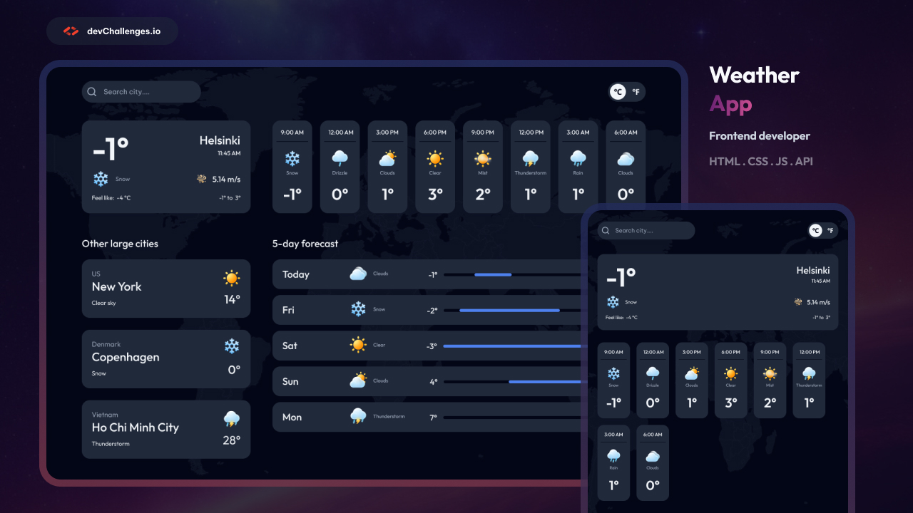

# 🌤️ Weather App – devChallenges.io

> A fully responsive weather application built with React, OpenWeatherMap API, and Vercel serverless functions.

## 📌 Live Demo

🔗 [View Live Demo](https://your-vercel-url.vercel.app)  
*(Ganti dengan URL Vercel Anda setelah deploy)*

## 🧩 Deskripsi Proyek

Weather App adalah aplikasi cuaca yang menampilkan informasi cuaca terkini, prakiraan per jam (24 jam ke depan), serta prakiraan 5 hari ke depan. Pengguna dapat mencari kota, mengganti satuan suhu (°C/°F), dan melihat cuaca kota-kota besar dunia sebagai referensi cepat.

Proyek ini merupakan solusi dari tantangan [Weather App Challenge](https://devchallenges.io/challenge/weather-app) di devChallenges.io.

## ✨ Fitur Utama

- ✅ **Cuaca Saat Ini** – suhu, feels like, kecepatan angin, suhu min/max, dan ikon cuaca.
- ✅ **Prakiraan Per Jam** – 8 interval (24 jam ke depan) dengan ikon dan suhu.
- ✅ **Prakiraan 5 Hari** – range suhu harian dengan slider visual, ikon, dan deskripsi cuaca.
- ✅ **Pencarian Kota** – cari kota mana pun di dunia (menggunakan OpenWeatherMap Geocoding API).
- ✅ **Toggle Satuan** – ubah antara Celsius (°C) dan Fahrenheit (°F).
- ✅ **Daftar Kota Besar** – tampilkan Jakarta, London, Tokyo, New York sebagai shortcut cepat.
- ✅ **Responsif** – mobile, tablet, dan desktop (mengikuti desain dari devChallenges).
- ✅ **Serverless API** – endpoint Vercel sebagai proxy ke OpenWeatherMap (melindungi API key).

## 🛠️ Teknologi yang Digunakan

- **Frontend**: React 18 (tanpa build tool – menggunakan CDN + Babel standalone)
- **HTTP Client**: Axios
- **Styling**: CSS murni dengan flexbox, grid, dan media queries
- **API**: OpenWeatherMap (Current Weather, 5-day Forecast, Geocoding)
- **Backend (Serverless)**: Vercel Functions (`/api/geo`, `/api/weather`, `/api/forecast`)
- **Deployment**: Vercel

## 📁 Struktur Proyek

weather-app/
├── api/
│ ├── geo.js # Geocoding endpoint
│ ├── weather.js # Current weather endpoint
│ └── forecast.js # 5-day forecast endpoint
├── resources/
│ ├── earth.png
│ ├── Search.svg
│ ├── wind.png
│ └── *.png # Ikon cuaca (01d.png, 02d.png, ...)
├── index.html
├── style.css
├── script.js
├── package.json # (opsional) dengan {"type": "module"}
└── README.md

